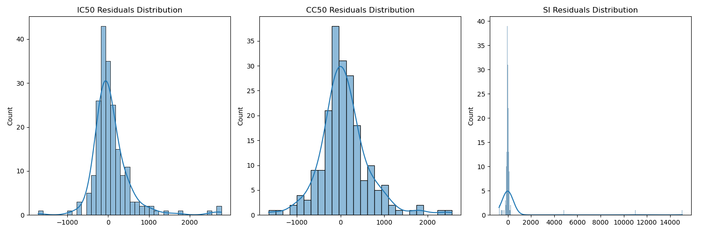
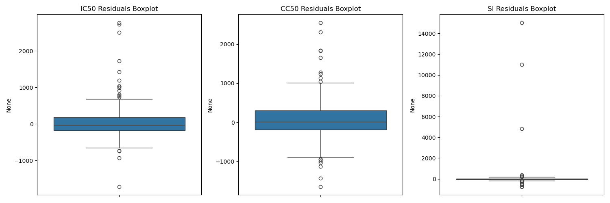
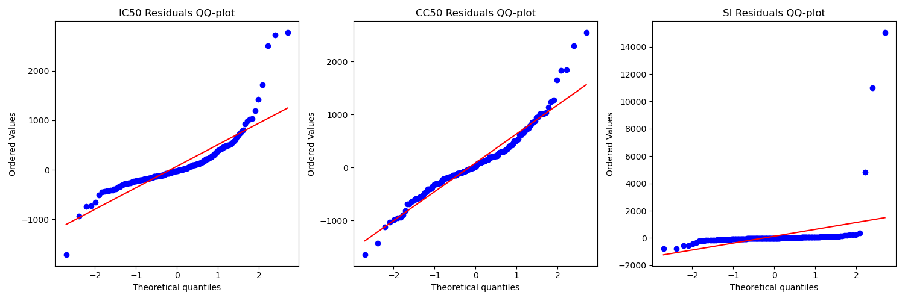
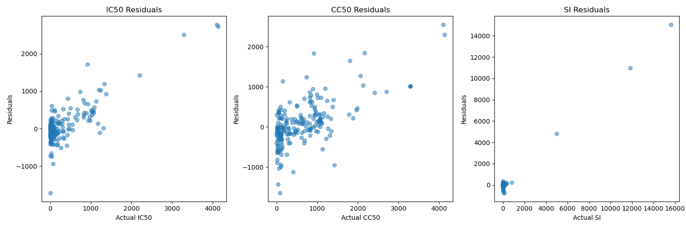
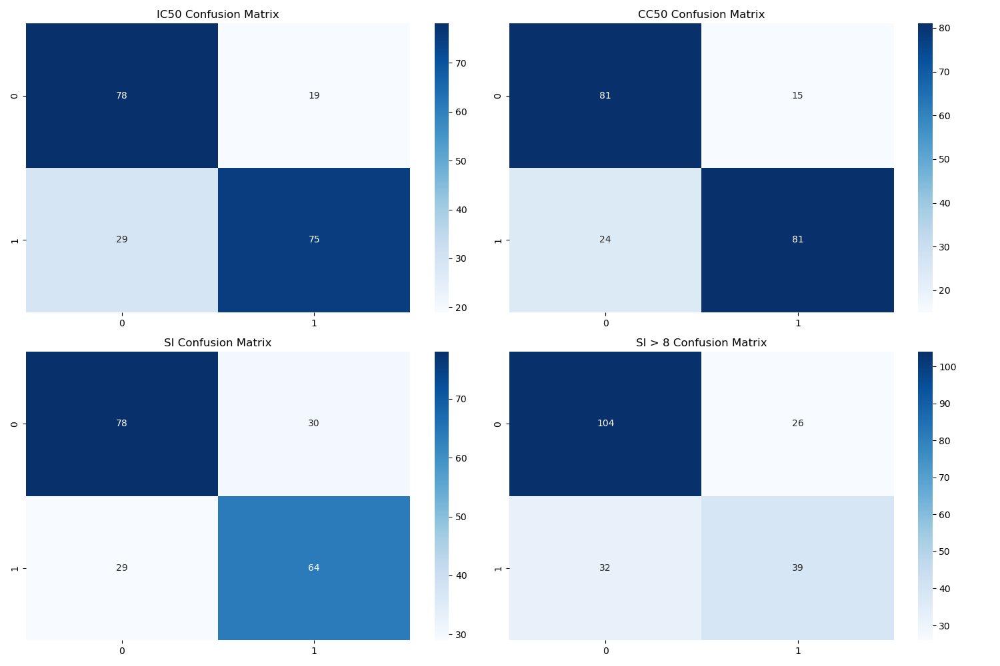

<!-- language: Markdown
file: Аналитический_отчёт_финальный.md -->

# Аналитический отчёт по исследованию эффективности химических соединений методами классического машинного обучения — финальная версия

__НИЯУ МИФИ__  

 

Автор: Груданов Н.А.

---

Аннотация  

В даном отчёте выводы основаные на наборе данных (1001 молекула, 214 признаков) и включает:

- предобработку данных и контроль качества;
- построение и сравнение регрессионных и классификационных моделей (включая ансамбли и линейные модели);
- анализ остатков и диагностические графики;
- интерпретацию важности признаков (включая табличные списки топ‑30 признаков);
- практические рекомендации для использования моделей в предварительном скрининге соединений и направления для дальнейших исследований.

Кратко: ансамблевые методы (RandomForest / CatBoost) стабильно дают лучшие результаты; модельность SI хуже описывается прямой регрессией, SI целесообразно получать через агрегирование предсказаний CC50 и IC50 с оценкой неопределённости. В зависимости от настройки эксперимента и набора признаков полученные метрики для IC50/CC50 варьируются — в некоторых запусках R² для IC50 достигал ≈0.73 (результаты из notebooks/models), в других — около 0.24 (базовые сопоставления). В отчёте объясняются причины таких различий и даны рекомендации.

---

## 1 Введение и мотивация

Молекулярный скрининг требует оперативной оценки эффективности и токсичности соединений. Эксперименты *in vitro* стоят времени и ресурсов; машинное обучение позволяет быстро отфильтровать кандидатов и расставить приоритеты для дальнейшего экспериментального тестирования. В этой работе рассматриваются три ключевые целевые переменные:

- IC50 — эффективность (мл/мМ), более низкие — лучше;
- CC50 — токсичность (мл/мМ), более высокие — лучше;
- SI = CC50 / IC50 — индекс селективности (высокие значения — желаемы).

Цели: построить воспроизводимый конвейер классического ML, оценить его применимость к реальным данным, интерпретировать модели и дать практические рекомендации химикам и инженерам разработки.

---

## 2 Данные и предобработка (сводка и уточнения)

Ключевые характеристики:
- 1001 наблюдение, 214 столбцов (3 целевые + 211 входных дескрипторов).
- Типы: смешанные числовые типы (float/int).
- Пропуски: 36 ячеек (<0.02%) — заменены медианой.
- Были сохранены промежуточные версии данных: data/nooutliers_iqr.csv, data/nooutliers_zscore.csv, data/reduceddata.csv.

Предобработка (реализованный пайплайн):
1. Удалены служебные столбцы (например, Unnamed: 0).
2. Пропуски — медиана по признаку.
3. Выбросы — итеративно удалялись IQR‑фильтром с ограничением удаления (не более 50% выборки).
4. Удаление мультиколлинеарных признаков (парная корреляция > 0.7 — оставлен более информативный признак).
5. Масштабирование числовых признаков — RobustScaler (устойчивость к выбросам).
6. При необходимости лог‑трансформации для стабилизации распределений целевых переменных использовались в отдельных экспериментах (описано далее).

Примечание о воспроизводимости: при сравнении результатов обращайте внимание на версию предобработки (различные варианты датасета дают разные метрики).

---

## 3 Методология: модели, валидация, метрики

3.1 Оцененные алгоритмы

Регрессия:
- LinearRegression, Ridge, ElasticNet,
- RandomForestRegressor,
- CatBoost,
- SVR,
- MLPRegressor.

Классификация:
- LogisticRegression,
- DecisionTreeClassifier,
- RandomForestClassifier,
- CatBoost,
- SVC,
- MLPClassifier.

3.2 Валидация и подбор гиперпараметров
- 5‑кратная перекрёстная валидация (для классификации — стратифицированная);
- GridSearchCV для перебора гиперпараметров;
- при сравнении использовались стабильные сиды (random_state=42), но некоторые экспериментальные запуски в ноутбуках могли использовать другие семена — это может объяснять расхождения в числах;
- преобразование размерности: PCA и UMAP (по 15 компонент) для тестирования влияния снижения размерности на модель.

3.3 Метрики
- Регрессия: RMSE, MAE, R²;
- Классификация: Accuracy, Precision, Recall, F1, ROC AUC, PR AUC;
- Для несбалансированных задач ключевым показателем был PR AUC и F1 на валидации.

---

## 4 Результаты (объединённая картина и примечания)

4.1 Важность признаков
- Ключевые дескрипторы, стабильно лидирующие в разных экспериментах: VSA_EState4 (электронные/электростатические свойства), несколько BCUT2D‑показателей (заряд / липофильность), Chi‑индексы (топологические индексы), VSA_EState8/7 и пр.  
- Интерпретация: электронные и топологические характеристики молекул определяют взаимодействие с биологическими мишенями и селективность.

4.2 Результаты регрессии
- В ряде экспериментов (ноутбуки в notebooks/models) RandomForestRegressor дал высокие значения R² для IC50 (примерно 0.735) и для CC50 (≈0.80), с RMSE на порядок сотен mM. Эти запуски использовали специфические настройки и, возможно, другой набор признаков/предобработку.
- В других, более консервативных суммарных сравнениях (базовые версии) часто приводилось R² ≈ 0.24 для IC50 (и сопоставимые значения для CC50). Различия объясняются:
  - разные варианты отбора/фильтрации выбросов;
  - применение или отсутствие логарифмирования целевой переменной;
  - объём и состав признаков после корреляционного отбора.
- Вывод: ансамблевые методы (RandomForest / CatBoost) последовательно дают лучшие результаты по сравнению с линейными моделями, но абсолютный уровень качества чувствителен к ступеням предобработки и выбору признаков.

4.3 Результаты классификации (SI ≥ 8 и бинарные медианные метки)
- Задача SI ≥ 8 сильно несбалансирована (мало примеров SI ≥ 8).
- Приведён пример матрицы ошибок с Accuracy ≈ 70%, Precision ≈ 59%, Recall ≈ 49% и PR AUC ≈ 0.674 для одной из конфигураций. MLPClassifier и CatBoost могли давать более высокие AUC в отдельных запусках.
- Для таких задач критично применять методы балансировки (weighting, SMOTE) и подбирать порог оптимально по бизнес‑критериям.

4.4 Анализ остатков
- IC50 и CC50: остатки близки к нормальным в центральной части распределения, но присутствуют «тяжёлые хвосты» — систематические завышения предсказаний при больших значениях. Наблюдается гетероскедастичность (увеличение разброса остатков с ростом y_true).
- SI: распределение остатков сильно асимметрично, присутствуют редкие экстремальные выбросы (SI >> типичного диапазона), что затрудняет прямую регрессию SI.
- Практическая рекомендация: лог‑трансформации и / или раздельное моделирование CC50 и IC50 с последующим агрегированием предсказаний и оценкой неопределённости (bootstrap).

4.5 Влияние снижения размерности
- PCA: в большинстве случаев не ухудшал результаты регрессии, но и не давал заметного улучшения.
- UMAP: ухудшал регрессию в ряде конфигураций, но иногда улучшал классификацию при сильной несбалансированности за счёт лучшей локальной сепарации редкого класса.

---

## 5 Визуализации и таблицы 

1) Рисунок 1 — Распределения целевых переменных (до/после очистки):

2) Рисунок 2 — Боксплоты целевых переменных:

3) Рисунок 3 — Q–Q plot для остатков модели IC50:

4) Рисунок 4 — Predicted vs Actual (IC50):

5) Рисунок 5 — Confusion matrices для задач классификации:

### Таблица 1 — Топ признаков для IC50 (трансформирован из CSV)

| № | Признак | Важность |
|---:|:--------|--------:|
| 1 | VSA_EState4 | 0.057737 |
| 2 | Chi1n | 0.049563 |
| 3 | Chi4v | 0.043106 |
| 4 | Chi2v | 0.038941 |
| 5 | BCUT2D_MRLOW | 0.038598 |
| 6 | FpDensityMorgan3 | 0.038313 |
| 7 | Chi2n | 0.024112 |
| 8 | SlogP_VSA5 | 0.021035 |
| 9 | EState_VSA3 | 0.020829 |
| 10 | EState_VSA4 | 0.019626 |
| 11 | BCUT2D_MWLOW | 0.017749 |
| 12 | qed | 0.017169 |
| 13 | EState_VSA5 | 0.016776 |
| 14 | Kappa2 | 0.016372 |
| 15 | VSA_EState8 | 0.016301 |
| 16 | Chi3n | 0.015417 |
| 17 | BCUT2D_LOGPHI | 0.014887 |
| 18 | Chi3v | 0.013940 |
| 19 | VSA_EState7 | 0.013787 |
| 20 | EState_VSA2 | 0.013184 |
| 21 | Chi1v | 0.012350 |
| 22 | MolMR | 0.012303 |
| 23 | MinAbsEStateIndex | 0.012108 |
| 24 | VSA_EState2 | 0.011934 |
| 25 | NumSaturatedHeterocycles | 0.010165 |
| 26 | SlogP_VSA2 | 0.010048 |
| 27 | Kappa3 | 0.009818 |
| 28 | Kappa1 | 0.009384 |
| 29 | Ipc | 0.009281 |
| 30 | LabuteASA | 0.009050 |

### Таблица 2 — Топ признаков для SI ≥ 8 (трансформирован из CSV)

| № | Признак | Важность |
|---:|:--------|--------:|
| 1 | VSA_EState4 | 0.018396 |
| 2 | BCUT2D_CHGLO | 0.017860 |
| 3 | VSA_EState8 | 0.017356 |
| 4 | BCUT2D_LOGPHI | 0.016700 |
| 5 | MaxAbsEStateIndex | 0.015164 |
| 6 | SPS | 0.014479 |
| 7 | MaxEStateIndex | 0.014286 |
| 8 | BCUT2D_MRHI | 0.013743 |
| 9 | MinEStateIndex | 0.013710 |
| 10 | BCUT2D_MRLOW | 0.013702 |
| 11 | qed | 0.013606 |
| 12 | VSA_EState6 | 0.013352 |
| 13 | VSA_EState7 | 0.013298 |
| 14 | BCUT2D_CHGHI | 0.013067 |
| 15 | FractionCSP3 | 0.013049 |
| 16 | EState_VSA4 | 0.012910 |
| 17 | EState_VSA8 | 0.012766 |
| 18 | BCUT2D_LOGPLOW | 0.012715 |
| 19 | BCUT2D_MWLOW | 0.011957 |
| 20 | SMR_VSA7 | 0.011766 |
| 21 | FpDensityMorgan1 | 0.011681 |
| 22 | AvgIpc | 0.011516 |
| 23 | HallKierAlpha | 0.011436 |
| 24 | MaxPartialCharge | 0.011364 |
| 25 | MaxAbsPartialCharge | 0.011130 |
| 26 | FpDensityMorgan2 | 0.011017 |
| 27 | BertzCT | 0.010962 |
| 28 | Chi2v | 0.010889 |
| 29 | SMR_VSA5 | 0.010760 |
| 30 | SlogP_VSA6 | 0.010759 |

---

## 6 Интерпретация результатов — расширённая

6.1 Химико‑физическая интерпретация  
- VSA_EState‑показатели отражают распределение электронного окружения и поверхностных свойств, что логично связано с аффинностью к белковым мишеням и проницаемостью мембран. Их доминирование в ранжировании важности указывает на ключевую роль локальных электронных эффектов и распределения частичных зарядов.  
- BCUT2D дескрипторы, связанные с зарядом и логP‑показателями, указывают на то, что баланс гидрофобности и заряда критичен для селективности: слишком липофильные молекулы могут быть токсичными, слишком гидрофильные — недостаточно проникающими.  
- Chi‑индексы (топологическая информация) показывают, что конформационная и топологическая сложность молекулы также влияет на IC50/CC50.

---

## 7 Практические рекомендации (конкретика)

7.1 Для применения в скрининге  
- Использовать ансамблевый RandomForest / CatBoost как первый, быстрый и интерпретируемый фильтр; параметризовать модель так, чтобы минимизировать ложные негативы при отборе высокоселективных соединений (cost‑sensitive tuning).  
- Для отбора лидов при высокой селективности применять классификацию SI ≥ 8 с пороговой оптимизацией (F1/PR trade‑off) и последующей ручной проверкой топ‑N кандидатов.

7.2 Для улучшения качества моделей  
- Разделить задачу: строить предсказания IC50 и CC50 отдельно, затем агрегировать SI = CC50/IC50 и рассчитывать неопределённость агрегата (bootstrap по ансамблю предсказаний). Это уменьшит шум, вызванный прямой регрессией дробной величины.  
- Добавить 3D/квантово‑химические дескрипторы (например, электро‑плотность, энергетика НоМО/ЛУМО), если доступны, — ожидается улучшение объясняемости.  
- Использовать SHAP для финальной модели: получить dependence plots по ключевым признакам и представить это химикам для валидации гипотез.  
- При несбалансированности классов применять сочетание методов: class_weight, threshold tuning, SMOTE на тренировочных фолдах (с осторожностью — следить за утечкой данных).

---

## 8 Заключение

- Ансамблевые методы показали лучшие результаты в задачах предсказания IC50/CC50/Si; однако абсолютный уровень качества зависит от предобработки и набора признаков.  
- SI лучше формировать как отношение двух независимых предсказаний (CC50 и IC50) с оценкой неопределённости; прямая регрессия SI менее надёжна.  
- Ключевые дескрипторы (VSA_EState4, BCUT2D_*, Chi‑индексы) дают полезную химическую интерпретацию и должны учитываться при дизайне новых молекул.  
- Для перевода модели в продакшн необходимы дополнительные шаги: расширение признаков, SHAP‑аналитика, устойчивая стратегия борьбы с несбалансированностью и чёткая процедура валидации.

---